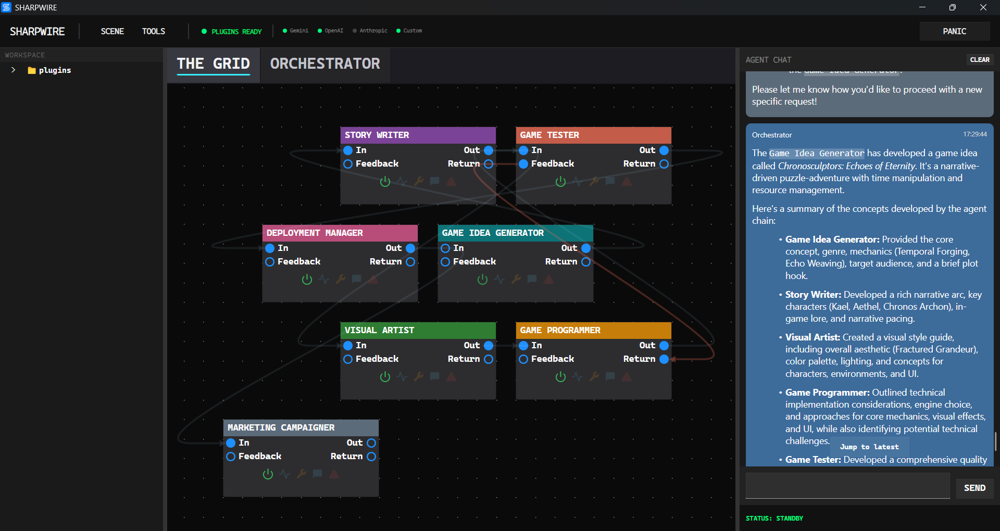

# Sharpwire

Sharpwire is a desktop playground for building and running multi-agent workflows visually.

It is intentionally **not** a production platform. The goal is to make it easy (and fun) to experiment with agent behavior, tool wiring, orchestration patterns, and plugin-driven extension without heavy setup.



## Why this is useful

- Build agent systems quickly with a visual graph instead of stitching everything together by hand.
- Try ideas fast: tweak prompts, tools, and handoff paths, then run again.
- Watch agent behavior in one place (chat, graph state, and logs).
- Explore orchestration patterns (explicit wired flows + orchestrator-driven delegation).
- Use it as a safe sandbox for learning, prototyping, and debugging agent concepts.

## What Sharpwire does

- **Visual agent graph**: connect agents with default and return/feedback handoffs.
- **Chat-driven execution**: send a task and let the orchestrator route work.
- **Tool-enabled agents**: agents can call tools and coordinate through handoffs.
- **Plugin system**: load workspace plugins and expose plugin settings in-app.
- **Session/workspace state**: persist scenes, agent layouts, and local settings.
- **Windows installer + auto-updates**: builds are published on GitHub Releases; the installed app can check for newer versions and apply updates (see **Settings → Updates**).

## Self-extending by design

One of the most interesting parts of Sharpwire is that it can **self-extend**:

- You can add new tools and behaviors via plugins.
- Agents can use existing tools to create or update assets in the workspace.
- The orchestrator can incorporate new capabilities as they become available.

In short: Sharpwire can grow its own toolbox while you experiment, which makes it great for agentic prototyping and "what if?" workflows.

## Who this is for

- Developers curious about multi-agent systems.
- People experimenting with orchestration, tools, and prompt design.
- Anyone who wants a local, visual way to play with agents for fun.

If you need hardened reliability, strict security boundaries, or enterprise guarantees, this project is not aiming for that today.

## Quick start (run the app)

Sharpwire is a **Windows desktop app**. The fastest way to try it is the latest installer from **[GitHub Releases](https://github.com/distantdev/sharpwire/releases)**.

1. From that page, download the **latest** Windows installer (the setup `.exe` from the newest release).
2. Run the installer and launch **Sharpwire**.
3. Open **Settings** and add the **LLM provider API keys** you plan to use.
4. Use the default **workspace** folder (or pick another) and open the **Chat** tab.
5. Send a prompt (see [Example prompts](#example-prompts) below). Watch the **graph**, **chat**, and **agent logs** as the orchestrator delegates work.

## Example prompts

Use these as copy-paste starters once keys are configured. They are meant to show **delegation**, **tools**, and **multi-step** behavior—not to be “perfect” tasks.

- **Simple handoff** — *“Ask the Coder to add a small `hello.py` in the workspace that prints a classic Python hello-world line, then ask the Reviewer to skim the script and confirm it is reasonable.”*
- **Team of agents** — *“Create a team of agents that can brainstorm, implement, and market a text-based Python game.”*
- **Iterate on a file** — *“Create `notes.md` with three bullet ideas for a weekend project, then improve the wording and save the result.”*
- **Explore the graph** — *“Explain what agents you see on the graph and what you would delegate to each one for a ‘parse a CSV and suggest column types’ task—don’t run tools yet, just the plan.”*

After each run, tweak the graph (agents, wiring, tools) and send the same prompt again to compare behavior.

## Local development

Use this path when you want to **change Sharpwire itself** or run from source.

**Prerequisites**

- Windows with **[.NET 10 SDK](https://dotnet.microsoft.com/download)** installed.

**Run from the repository**

```powershell
git clone https://github.com/distantdev/sharpwire.git
cd sharpwire
dotnet build
dotnet run --project Sharpwire.csproj
```

Then configure **Settings** (API keys) the same way as the installed build. For how releases are built and published, see `RELEASES.md`.

---

Sharpwire is about rapid iteration, playful exploration, and learning by building agent systems hands-on.
